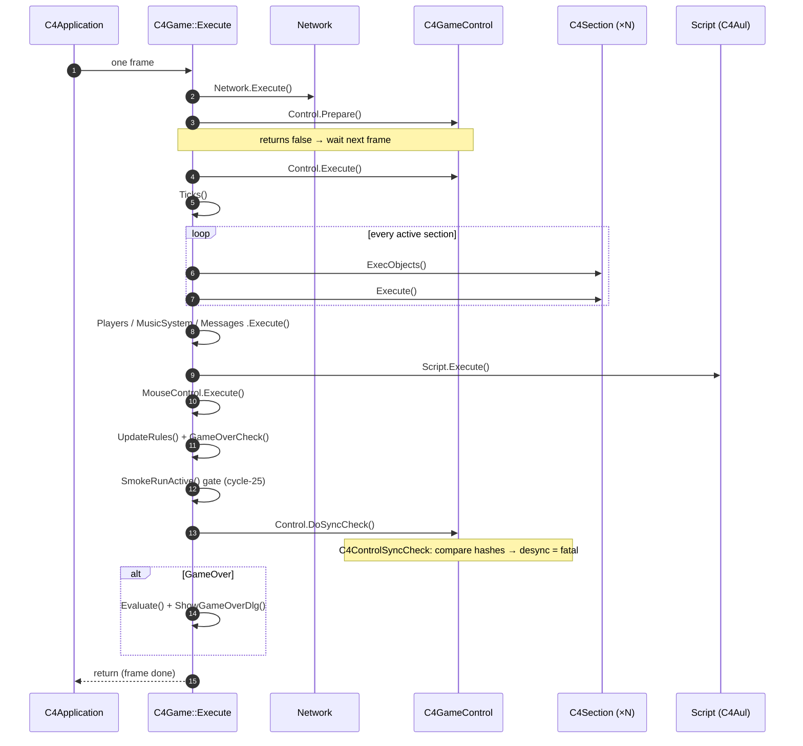
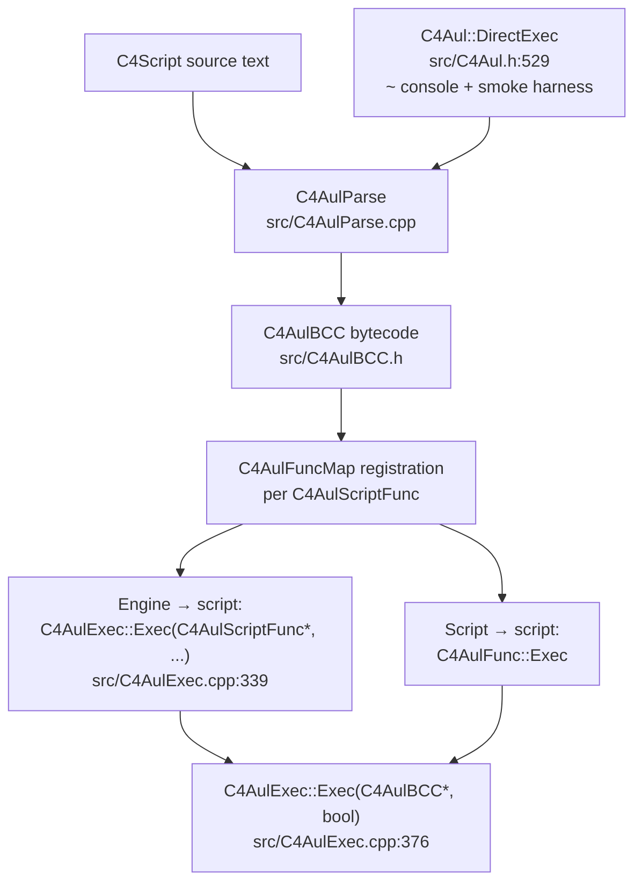
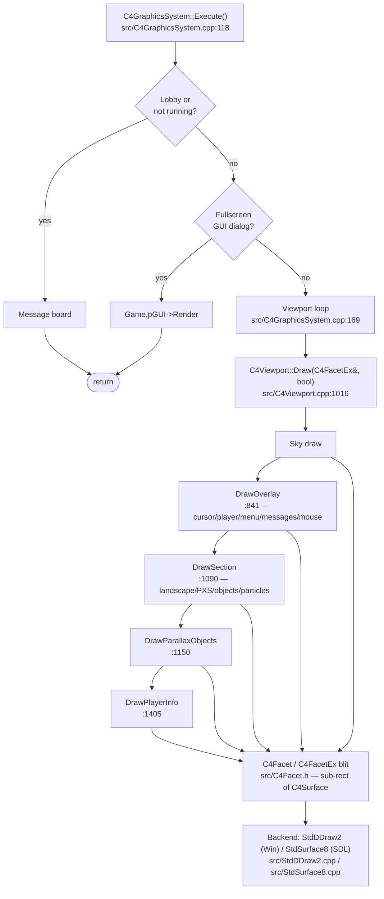

# Engine architecture

This page maps the LegacyClonk engine source (`LegacyClonk/src/`) for a
contributor reading it for the first time. It is not a C++ tutorial and not
an exhaustive engine reference — it is an onboarding map. Cross-links into
the modder-facing [C4Script guide](../c4script/index.md) and
[callback reference](../reference/callbacks/object-lifecycle.md) appear at
the end of each reader's-guide section.

Citations use **filename + class/function name** (e.g. "`C4Game::Execute` in
`src/C4Game.cpp`") rather than `file:line`, because filenames and symbol
names survive refactors. Six `file:line` convenience jump targets are
included — one per dynamic flow — verified at write time. If a jump misses,
`grep -n <symbol> <file>` finds the current line.

---

## How LegacyClonk is organised

The engine is a flat tree of `C4*`-prefixed classes (`C4Game`,
`C4GameControl`, `C4GraphicsSystem`, …) sitting on top of a `Std*` utility
layer (`StdApp`, `StdBuf`, `StdDDraw2`, `StdSurface8`, …). The `Std*` layer
provides OS/process primitives, buffer/string types, and the rendering
backends; the `C4*` layer implements the game engine. Cross-layer calls flow
top-down: `C4*` calls `Std*`, never the reverse.

Three include-discipline conventions hold across the tree:

1. **`#pragma once`** guards every header (no `#ifndef` include guards).
2. **`C4ForwardDeclarations.h`** centralises forward declarations for the
   `C4*` classes, so headers can avoid pulling in transitive includes.
   `src/C4ForwardDeclarations.h` is the canonical place to add a forward
   declaration when a header only needs a pointer/reference type.
3. **`C4ForwardDeclarations.h` is the only forward-declaration header.**
   Ad-hoc forward declarations in other headers are discouraged; the
   centralised file is the single source of truth.

The table below groups the ~199 `C4*` headers in `src/` by subsystem. "Entry
point" is the file a new contributor should open first to understand that
subsystem — it is expanded into the "Where to start reading" list in §6.

| Subsystem | Key files | Role | Entry point |
|---|---|---|---|
| App / main loop | `C4Application`, `C4Game`, `C4WinMain`, `StdApp` | Process bootstrap (`C4Application` extends `CStdApp`), the frame loop in `C4Game::Execute()`, quit/restart handling | `C4Application.{h,cpp}` then `C4Game::Execute()` in `C4Game.cpp` |
| Game world | `C4Section`, `C4Landscape`, `C4Object`, `C4ObjectList`, `C4GameObjects`, `C4Material`, `C4PXS`, `C4Weather`, `C4Sky`, `C4MassMover`, `C4SolidMask`, `C4Shape`, `C4Particles`, `C4PathFinder`, `C4Map`, `C4MapCreatorS2`, `C4TransferZone` | Section lifecycle, landscape (material map + pixels), objects, material definitions, particle/physics extras, weather, sky, mass-mover, solid-mask, shape, particles, pathfinding, map creator, transfer zones | `C4Section.{h,cpp}` then `C4Landscape.{h,cpp}` |
| C4Aul (scripting) | `C4Aul`, `C4AulExec`, `C4AulParse`, `C4AulBCC`, `C4AulFunc`, `C4AulScriptFunc`, `C4AulScriptStrict`, `C4Script`, `C4ScriptHost`, `C4Value`, `C4ValueList`, `C4ValueMap`, `C4StringTable`, `C4String`, `C4ScriptArgumentAdapters`, `C4ScriptValueConv`, `C4ScriptHelpers` | Parse C4Script source, compile to `C4AulBCC` bytecode, interpret via `C4AulExec`; `DirectExec` ad-hoc path for the `~` console and smoke harness; `C4Value` dynamic-type runtime | `C4Aul.h` (public API), then `C4AulExec.cpp` (interpreter) |
| Control / Network | `C4GameControl`, `C4GameControlNetwork`, `C4Network2`, `C4Network2IO`, `C4Network2Address`, `C4Network2Client`, `C4Network2Reference`, `C4Network2Res`, `C4Network2Discover`, `C4Network2UPnP`, `C4Network2IRC`, `C4Network2Players`, `C4Network2Stats`, `C4NetIO`, `C4Client`, `C4Control`, `C4ControlSyncCheck`, `C4InputValidation`, `C4League`, `C4GameLobby`, `C4GameParameters`, `C4PlayerInfo`, `C4Record`, `C4Replay`, `C4ReplayController` | Lockstep input queue (`C4GameControl` modes `CM_Local`/`CM_Network`/`CM_Replay`), network I/O, lobby, league, replay record/playback, determinism gate (`C4ControlSyncCheck`) | `C4GameControl.h` (modes + sync-check declarations), then `C4GameControl.cpp` `Prepare`/`Execute`/`DoSyncCheck` |
| Rendering | `C4GraphicsSystem`, `C4Viewport`, `C4Facet`, `C4FacetEx`, `C4Surface`, `C4SurfaceFile`, `C4Texture`, `C4DefGraphics`, `C4GraphicsResource`, `C4Fonts`, `StdDDraw2`, `StdSurface8` | Per-frame draw composition (`C4GraphicsSystem::Execute`), viewport iteration, per-viewport draw (`C4Viewport::Draw`), `C4Facet` blit primitive, SDL (`StdSurface8`) vs DirectDraw (`StdDDraw2`) backends | `C4GraphicsSystem.cpp` `Execute()`, then `C4Viewport::Draw` in `C4Viewport.cpp` |
| UI / GUI | `C4Gui`, `C4FullScreen`, `C4Console`, `C4Menu`, `C4ObjectMenu`, `C4MessageBoard`, `C4MessageInput`, `C4MouseControl`, `C4KeyboardInput`, `C4GamePadCon`, `C4MainMenu`, `C4GameOverDlg`, `C4Startup*Dlg`, `C4LoaderScreen`, `C4UpperBoard`, `C4HudBars`, `C4Scoreboard`, `C4EditCursor`, `C4PropertyDlg`, `C4ToolsDlg`, `C4DevmodeDlg`, `C4DownloadDlg`, `C4UpdateDlg` | Dialogs, menus, fullscreen/console, message board, mouse/keyboard/gamepad input, startup/scenario/replay/player selection dialogs, loader screen, upper board, HUD bars, scoreboard, edit cursor, property/tools/devmode dialogs, download/update dialogs | `C4Gui.h` then `C4FullScreen.{h,cpp}` |
| Audio | `C4SoundSystem`, `C4MusicSystem`, `C4AudioSystem`, `C4AudioSystemSdl`, `C4AudioSystemNone` | SFX playback, music streaming, audio backend selection (SDL / null) | `C4SoundSystem.{h,cpp}` then `C4MusicSystem.{h,cpp}` |
| Storage | `C4Group`, `C4GroupSet`, `C4Folder`, `C4File`, `C4FileClasses`, `C4FileMonitor`, `C4Def`, `C4DefGraphics`, `C4Network2Res`, `C4SurfaceFile`, `C4LangStringTable`, `C4Language`, `C4StringTable`, `C4ResStrTable` | `.c4g`/`.c4d`/`.c4f` container format (`C4Group`), definition loading (`C4Def`), resource cache (`C4Network2Res`), language/string tables | `C4Group.{h,cpp}` then `C4Def.{h,cpp}` |
| Config / glue | `C4Config`, `C4Constants`, `C4ForwardDeclarations`, `C4Log`, `C4LogBuf`, `C4InteractiveThread`, `C4Thread`, `C4ThreadPool`, `C4Chrono`, `C4Coroutine`, `C4Awaiter`, `C4Toast*`, `C4CurlSystem`, `C4HTTPClient`, `C4OpenURL`, `C4Stat`, `C4Breakpoint`, `C4RTF`, `C4TextEncoding`, `C4Wrappers` | Engine config (`C4Config`), shared constants, centralised forward declarations, logging, interactive/thread glue, chrono/coroutine/awaiter utilities, toast notifications, HTTP/curl, stats, breakpoints, RTF, text encoding, wrappers | `C4Config.{h,cpp}` then `C4ForwardDeclarations.h` |

The `Std*` layer is included in the table only where it is the direct
backend for a `C4*` subsystem (e.g. `StdDDraw2` and `StdSurface8` under
Rendering, `StdApp` under App / main loop). The full `Std*` surface is
larger but not engine-subsystem-shaped.

---

## The main loop

The engine's frame loop is `bool C4Game::Execute()` in `src/C4Game.cpp`
(definition at `src/C4Game.cpp:986`; the function name is the durable
pointer). `C4Application::Execute()` dispatches on `AppState`
(`PreInit` / `Startup` / `Game` / `Quit`) and calls `Game.Execute()` while
in the `Game` state. One call to `C4Game::Execute()` runs exactly one frame.

The annotated call list, in source order:

1. **Replay scrub hooks.** If `Control.isReplay()`, poll
   `C4ReplayController` for pause / speed / forward-seek / backward-seek.
   Forward-seek tight-loops `Execute()` re-entries; backward-seek was
   already done by `SoftRestartForReplaySeek`. (`src/C4Game.cpp:991–1057`.)
2. **`Network.Execute()`** — drain the network packet queue
   (`src/C4Network2.cpp`).
3. **`Control.Prepare()`** — collect inputs into the control queue; returns
   `false` if the frame is not ready yet (the loop waits).
   (`src/C4GameControl.cpp:288`.)
4. **`CheckLoadedSections()` / `SectionRemovalCheck()`** — section
   load/unload bookkeeping.
5. **`Control.Execute()`** — run the control queue: applies inputs, runs
   `C4Control` packets, fires `DoSyncCheck` at the right tick.
   (`src/C4GameControl.cpp:328`.)
6. **`Ticks()`** — per-tick callbacks (timer effects, weather, etc.).
7. **Per-section `ExecObjects` + `Execute`** — every active section runs
   its object list and its own section-execute (physics, weather, PXS).
8. **`Players.Execute()` / `MusicSystem->Execute()` / `Messages.Execute()`
   / `Script.Execute()`** — player bookkeeping, music streaming, message
   board, and the C4Aul script engine tick.
9. **`MouseControl.Execute()`** — mouse input → cursor → object command.
10. **`UpdateRules()` + `GameOverCheck()`** — per-frame rule evaluation and
    the game-over transition.
11. **`SmokeRunActive()` gate** — if `--smoke-run N` is set and the tick
    count is reached or `GameOver` fired, set `fQuitWithError` when the
    fatal stack is non-empty and call `Application.Quit()`. This is the
    cycle-25 headless smoke harness exit path.
12. **`Control.DoSyncCheck()`** — emit the determinism-gate packet
    (`C4ControlSyncCheck`); all clients compare hashes. Desync → fatal.
    (`src/C4GameControl.cpp:494`; `C4ControlSyncCheck` in
    `src/C4Control.cpp:460,493`.)
13. **`GameOver` branch** — if `GameOver`, `Evaluate()` (once) and
    `ShowGameOverDlg()` (once).
14. **Stat reset** — every 1000 ticks, `C4ST_SHOWPARTSTAT` / `C4ST_RESETPART`.

The Mermaid diagram below shows one frame's flow as a sequence between the
four subsystems that drive it. Read it top-to-bottom; each arrow is a call.



---

## Reader's guide: C4Aul

C4Aul is the C4Script interpreter. The pipeline is **parse → bytecode →
interpret**, with an ad-hoc `DirectExec` path that re-enters the parse
stage at runtime for uncompiled scripts.

→ **Full deep dive**: [c4aul.md](c4aul.md) — expanded call-graph tour,
error paths, and a worked example tracing an `Initialize()` callback.



!!! note "Modder-facing reference"
    The engine↔script bridge is documented from the script side in the
    [C4Script guide](../c4script/index.md): see
    [Syntax](../c4script/syntax.md), [Types](../c4script/types.md),
    [Effects](../c4script/effects.md), and
    [Callback convention](../c4script/callbacks-convention.md). The
    harvest-generated callback reference lives under
    [reference/callbacks/](../reference/callbacks/object-lifecycle.md).

---

## Reader's guide: Network lockstep

LegacyClonk's network model is **lockstep with a determinism gate**.
Every client runs the same simulation; the gate (`C4ControlSyncCheck`)
verifies per-tick that all clients reached the same state by comparing
a hash of the game state. A diverging hash is a desync — fatal.

→ **Full deep dive**: [network.md](network.md) — expanded call-graph
tour of `C4GameControl` modes, the control tick, network I/O, the
determinism gate, and a worked example tracing a player's movement
input.

```mermaid
sequenceDiagram
    autonumber
    participant C1 as Client A
    participant C2 as Client B
    participant H as Host
    participant Q as C4GameControl queue
    participant Sim as C4Game::Execute (per client)
    C1->>H: DoInput (local input A)
    C2->>H: DoInput (local input B)
    H->>H: DoInput (host's own input)
    H->>Q: Prepare() — wait until all inputs for frame N arrived
    H-->>C1: broadcast ordered input set for frame N
    H-->>C2: broadcast ordered input set for frame N
    par each client runs the same frame
        C1->>Sim: Execute() applies inputs
        C2->>Sim: Execute() applies inputs
        H->>Sim: Execute() applies inputs
    end
    Sim->>Sim: DoSyncCheck() — hash game state
    Note over C1,H: all three hashes must match; mismatch = desync (fatal)
```

!!! note "Modder-facing reference"
    Network play is transparent to C4Script — the same callbacks fire
    in `CM_Local`, `CM_Network`, and `CM_Replay`. The determinism
    constraint means modders must avoid non-deterministic operations
    (e.g. unsynchronised `Random()` calls outside engine-provided
    helpers). See [Callback convention](../c4script/callbacks-convention.md)
    and the [control callbacks reference](../reference/callbacks/control.md).

---

## Reader's guide: Rendering pipeline

Rendering is driven from `C4GraphicsSystem::Execute()` at
`src/C4GraphicsSystem.cpp:118`. The function short-circuits via
`StartDrawing()` if there is nothing to draw, then branches on
lobby/fullscreen-GUI state before reaching the viewport loop at line
169. Each viewport draws through a fixed sequence of `C4Facet` blits.

→ **Full deep dive**: [rendering.md](rendering.md) — expanded
call-graph tour of `C4GraphicsSystem::Execute`, `C4Viewport::Draw`,
the draw call sequence, `C4Facet` blit primitive, and a worked example
tracing a single frame's viewport draw.



!!! note "Modder-facing reference"
    Rendering is almost entirely engine-internal; modders interact with
    it via `C4Object` graphics properties (Action, Picture, Color,
    Overlay) documented in the [DefCore.txt fields reference](../reference/defcore.md)
    and the [Actions guide](../c4script/actions.md). The
    [BSD port doc](../BSD_PORT.md) covers the SDL-only rendering lane.

---

## Where to start reading

Recommended first file per subsystem — open it, read the class declaration,
then follow the entry point from the inventory table in §1.

- **App / main loop** → `C4Application.{h,cpp}` (the `CStdApp` subclass that
  owns the run loop), then `C4Game::Execute()` in `C4Game.cpp` (the
  per-frame call list — read §2 alongside it).
- **Game world** → `C4Section.{h,cpp}` (section lifecycle: load, execute,
  remove), then `C4Landscape.{h,cpp}` (material map + pixel buffer).
- **C4Aul** → `C4Aul.h` (public API surface), then `C4AulExec.cpp` (the
  interpreter — start at `C4AulExec::Exec` at `:339`).
- **Network lockstep** → `C4GameControl.h` (the three modes + sync-check
  declarations), then `C4GameControl.cpp` `Prepare`/`Execute`/`DoSyncCheck`
  in source order.
- **Rendering** → `C4GraphicsSystem.cpp` `Execute()` at `:118`, then
  `C4Viewport::Draw` in `C4Viewport.cpp` at `:1016`.
- **Control / Network I/O** → `C4Network2.h` (the network controller class
  at `:134`), then `C4Network2IO.{h,cpp}` (the wire-level I/O).
- **UI / GUI** → `C4Gui.h` (the GUI framework base), then
  `C4FullScreen.{h,cpp}` (the fullscreen GUI host).
- **Audio** → `C4SoundSystem.{h,cpp}` (SFX), then `C4MusicSystem.{h,cpp}`
  (music streaming).
- **Storage** → `C4Group.{h,cpp}` (the `.c4g`/`.c4d`/`.c4f` container
  format), then `C4Def.{h,cpp}` (definition loading).
- **Config / glue** → `C4Config.{h,cpp}` (engine config), then
  `C4ForwardDeclarations.h` (the centralised forward-declaration header).

---

## Out of scope for this page

The three subsystem deep dives — [C4Aul](c4aul.md),
[network lockstep](network.md), and [rendering pipeline](rendering.md)
— now exist as standalone pages. The fourth split page
(`adding-a-callback.md`) remains deferred to a follow-up cycle, gated
on a real reader need. The reader's-guide summaries above carry the
roadmap-named topics (main loop, C4Aul, network lockstep, rendering)
at a depth sufficient for onboarding. See the spec's *Out of scope*
section for the full list.

---

!!! seealso "See also"
    - [Contributing](contributing.md) — build, test, and open a PR
    - [C4Aul deep dive](c4aul.md)
    - [Network lockstep deep dive](network.md)
    - [Rendering pipeline deep dive](rendering.md)
