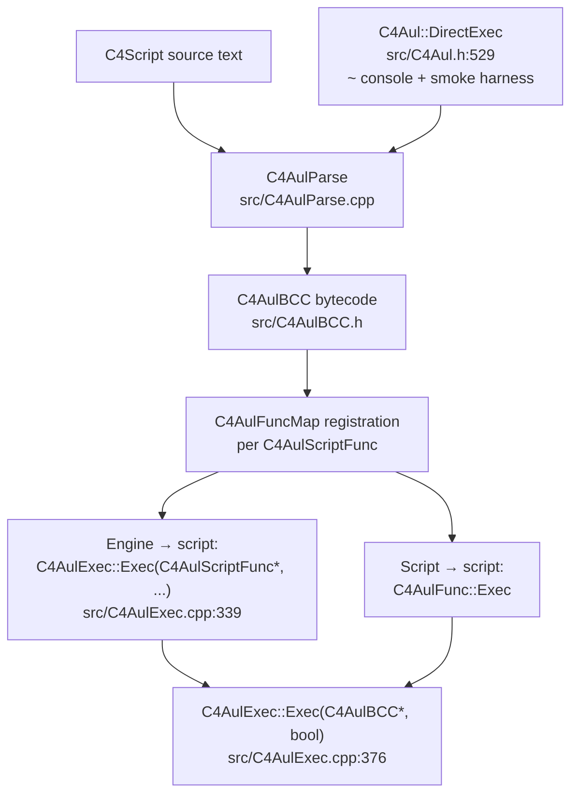

# C4Aul deep dive

C4Aul is the C4Script interpreter. The pipeline is **parse → bytecode →
interpret**, with an ad-hoc `DirectExec` path that re-enters the parse
stage at runtime for uncompiled scripts. Every `Object->~Callback()` the
engine fires ultimately lands in `C4AulExec::Exec`, so this is the
single hop between the C++ engine and C4Script.

---

## Reference walkthrough

### Engine → script entry

`C4Value C4AulExec::Exec(C4AulScriptFunc*, C4Section&, C4Object*, const
C4Value*, bool, bool)` in `src/C4AulExec.cpp` (definition at
`src/C4AulExec.cpp:339`; declaration in the class body at `:137`). This
is the single hop the engine makes to run a script function — every
`Object->~Callback()` ultimately lands here. The function:

1. Pushes a `C4AulBCC`-level context (the script function's bytecode
   and its value-stack frame).
2. Materialises the engine-supplied `C4Value` arguments onto the value
   stack.
3. Dispatches into the interpreter loop
   (`C4AulExec::Exec(C4AulBCC*, bool)` at `src/C4AulExec.cpp:376`).

The function name is the durable pointer; the `:339` line is a
convenience jump target verified at write time.

### Parse → bytecode

`C4AulParse` (`src/C4AulParse.cpp`) walks the C4Script source and emits
`C4AulBCC` bytecode opcodes (`src/C4AulBCC.h`). The bytecode is laid
out per-`C4AulScriptFunc`; `C4AulFuncMap` registers each function for
lookup by name. Opcode categories:

- **Stack ops** (`C4AulBCC::BC__PushData`, `BC__Pop`, …) — value-stack
  manipulation.
- **Calls** (`BC__Call` variants) — script→script and engine-function
  calls.
- **Branches** (`BC__Jmp`, conditional jumps) — control flow.

### Interpret

`C4AulExec::Exec(C4AulBCC*, bool)` (`src/C4AulExec.cpp:376`) is the
bytecode interpreter loop. It:

1. Fetches the next `C4AulBCC` opcode.
2. Dispatches on the opcode category.
3. Materialises `C4Value` arguments from the value stack.
4. Calls back into `C4AulFunc::Exec` for script→script calls (which
   re-enters `Exec(C4AulScriptFunc*, …)` at `:339`).

### Ad-hoc `DirectExec` path

`C4Aul::DirectExec` (`src/C4Aul.h:529`) parses and runs an uncompiled
script string at runtime — used by the `~` console and the cycle-25
`--smoke-run` smoke harness (which injects test assertions via
`FatalError(...)`). `DirectExec` re-enters the parser, so it is slow
and is explicitly not re-entrant-safe across cycles (see the
`Temporary` flag at `src/C4Aul.h:516`, set for `DirectExec`-scripts so
they are not re-parsed).

### Error and edge cases

- **Script errors** propagate via the `fPassErrors` flag and the
  `C4AulScriptFunc` error state; a script error mid-callback logs and
  returns `C4Value()` (nil).
- **Stack overflow** is guarded by the interpreter's per-call depth
  check; exceeding it raises a fatal log.
- **Missing function lookup** (`GetSFuncWarn` returns `nullptr`) logs a
  warning and returns nil rather than crashing.

---

## Worked example: Tracing an `Initialize()` callback

A scenario's `Script.c` defines `protected func Initialize() { ... }`.
When the scenario loads, the engine calls `Initialize()` on the
scenario object. The trace:

1. **Engine decides to fire `Initialize`.** During section load, the
   engine resolves the callback name `"Initialize"` against the
   scenario's `C4AulScript` and looks up the `C4AulScriptFunc` via
   `C4AulFuncMap`.
2. **Engine calls `C4AulExec::Exec` at `src/C4AulExec.cpp:339`.** The
   function pointer (the `C4AulScriptFunc*`) and the target object
   (`C4Object*`) are passed in; the `C4Value*` argument array is empty
   (`Initialize()` takes no parameters).
3. **Context push.** A new value-stack frame is pushed for this
   `C4AulScriptFunc`; the bytecode cursor is set to the function's
   first `C4AulBCC` opcode.
4. **Interpreter loop at `src/C4AulExec.cpp:376`.** The body of
   `Initialize()` — say, `CreateObject(Rock, ...)` — emits a
   `BC__Call` opcode for `CreateObject`, which is an engine function.
   The interpreter dispatches the call, the engine creates the object,
   and the return value is pushed onto the value stack.
5. **Return.** `Initialize()` returns; the interpreter pops the
   value-stack frame and returns the `C4Value` to the engine. The
   engine discards it (the return value of `Initialize` is not
   consulted).

---

!!! seealso "See also"
    - [Contributing](contributing.md) — build, test, and open a PR
    - [Network lockstep deep dive](network.md)
    - [Rendering pipeline deep dive](rendering.md)
    - [Engine architecture](architecture.md)
    - [C4Script guide](../c4script/index.md)
    - [Callback convention](../c4script/callbacks-convention.md)
