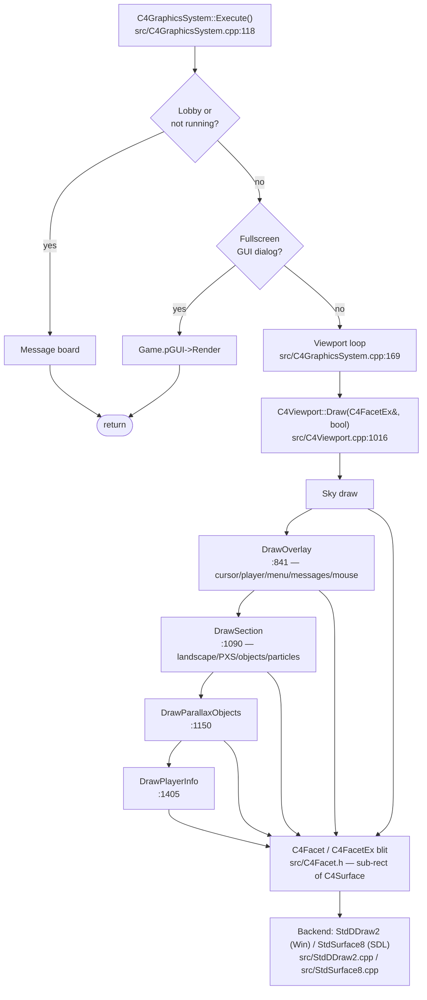

# Rendering pipeline deep dive

Rendering is driven from `C4GraphicsSystem::Execute()` at
`src/C4GraphicsSystem.cpp:118`. The function is called once per frame
from the render path (not from `C4Game::Execute()`); it short-circuits
via `StartDrawing()` if there is nothing to draw, then branches on
lobby/fullscreen-GUI state before reaching the viewport loop at line
169. Each viewport draws through a fixed sequence of `C4Facet` blits
into a `C4Surface`, which is then flipped to the screen by the backend
(`StdDDraw2` on Windows, `StdSurface8` on SDL).

---

## Reference walkthrough

### `C4GraphicsSystem::Execute`

`C4GraphicsSystem::Execute()` (`src/C4GraphicsSystem.cpp:118`) is the
per-frame render entry point. In source order:

1. **`StartDrawing()` activity check** — returns early if the graphics
   system is idle (no drawing needed this frame).
2. **Lobby / message-board branch** — if `Network.isLobbyActive()` or
   the game is not running, draw the message board and return.
3. **Fullscreen-GUI branch** — if a fullscreen dialog is active,
   render `Game.pGUI` and return.
4. **Background redraw + screen-rate frame skip.**
5. **`Game.ResetAudibility()`** — reset per-frame audio audibility.
6. **Viewport loop** at `src/C4GraphicsSystem.cpp:169`:
   `for (const auto &cvp : Viewports) cvp->Execute();`. Each
   `C4Viewport::Execute()` eventually calls
   `C4Viewport::Draw(C4FacetEx&, bool)` (`src/C4Viewport.cpp:1016`).
7. **Message board / upper board / help / hold-messages /
   flash-message** (fullscreen only).
8. **In-game GUI** (`Game.pGUI->Render()`).

### `C4Viewport::Draw` call sequence

`void C4Viewport::Draw(C4FacetEx &cgo, bool fDrawOverlay)` at
`src/C4Viewport.cpp:1016` is the per-viewport draw primitive. The draw
call sequence, in source order:

1. **Sky** (`C4ST_STARTNEW(SkyStat, "C4Viewport::Draw: Sky")`) — sky
   blit.
2. **`DrawOverlay`** (`src/C4Viewport.cpp:841`) — cursor info, player
   info, menu, messages, mouse. Called when `fDrawOverlay` is true.
3. **`DrawSection`** (`src/C4Viewport.cpp:1090`) — landscape, PXS,
   objects, particles (per visible section).
4. **`DrawParallaxObjects`** (`src/C4Viewport.cpp:1150`) — parallax
   objects drawn after sections.
5. **`DrawPlayerInfo`** (`src/C4Viewport.cpp:1405`) — player info
   overlay (scoreboard, player names).

Every leaf blit goes through `C4Facet` (`src/C4Facet.h`) — a sub-rect
of a `C4Surface` (`src/C4Surface.h`). `C4FacetEx`
(`src/C4FacetEx.h`) extends it with zoom/offset for viewport-relative
drawing.

### Backends

The `Std*` rendering layer has two backends:

- **`StdDDraw2`** (`src/StdDDraw2.cpp`) — DirectDraw on Windows.
- **`StdSurface8`** (`src/StdSurface8.cpp`) — SDL surface path used on
  Linux, macOS, and BSD. See `docs/BSD_PORT.md` for the SDL-only
  lane.

---

## Worked example: Tracing a single frame's viewport draw

Frame N enters `C4GraphicsSystem::Execute()` at
`src/C4GraphicsSystem.cpp:118`. The trace:

1. **`StartDrawing()`** — the graphics system is active, so we
   continue.
2. **Lobby check** — the game is running and the lobby is not active,
   so we skip the lobby branch.
3. **Fullscreen-GUI check** — no fullscreen dialog is active, so we
   skip the GUI branch.
4. **Viewport loop at `:169`** — for each viewport, call
   `cvp->Execute()`, which calls `C4Viewport::Draw(C4FacetEx&, bool)`
   at `src/C4Viewport.cpp:1016`.
5. **Inside `Draw`: Sky** — the sky is blitted first via `C4Facet`.
6. **`DrawOverlay` at `:841`** — cursor info, player info, menu,
   messages, mouse are drawn (if `fDrawOverlay` is true).
7. **`DrawSection` at `:1090`** — landscape, PXS, objects, particles
   for each visible section.
8. **`DrawParallaxObjects` at `:1150`** — parallax objects.
9. **`DrawPlayerInfo` at `:1405`** — player info overlay.
10. **Each leaf blit** goes through `C4Facet` → `C4Surface` → backend
    (`StdDDraw2` or `StdSurface8`).

---

!!! seealso "See also"
    - [C4Aul deep dive](c4aul.md)
    - [Network lockstep deep dive](network.md)
    - [Engine architecture](architecture.md)
    - [BSD port doc](../BSD_PORT.md)
