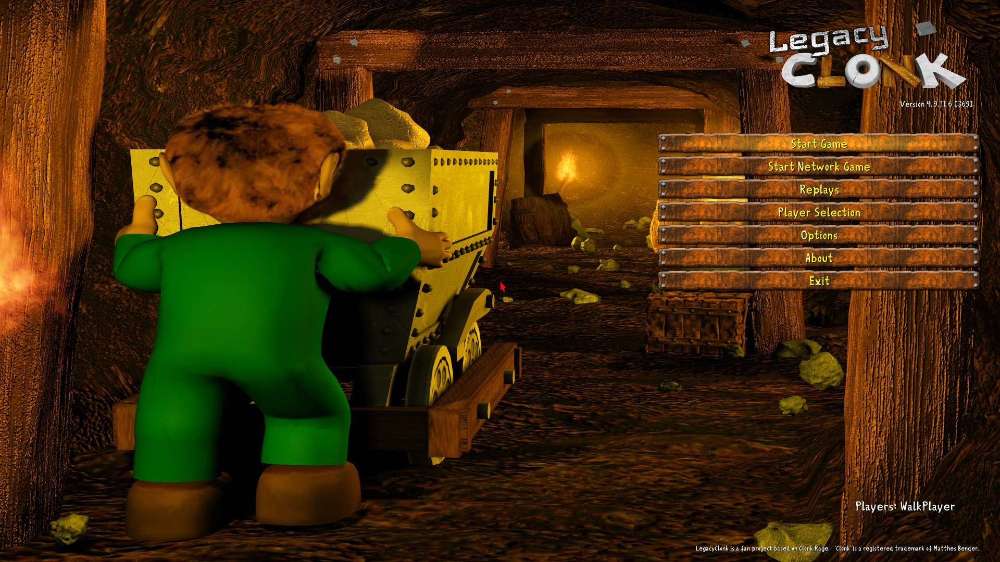
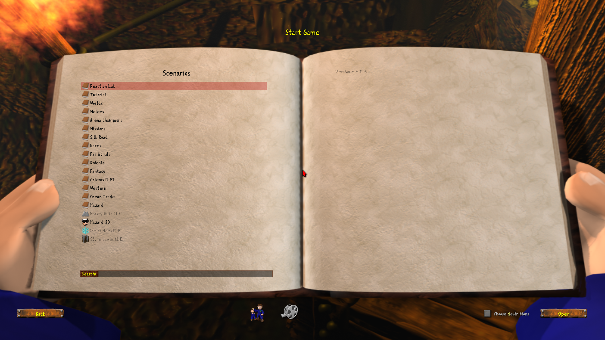
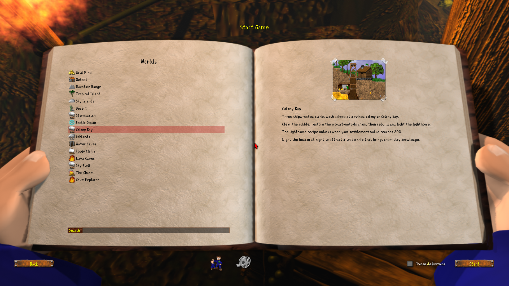

# Your first game in 5 minutes

Clonk is a tactical action game of digging, building, and commanding small
crews. This guide gets you playing your first settlement round in five
minutes on the shipped **Colony Bay** scenario.

[Launch Colony Bay](#1-start-colony-bay){ .md-button .md-button--primary }

!!! note "Don't have Colony Bay installed?"
    Colony Bay ships in the default content pack. See the
    [installation manual](https://clonkspot.org/lc-en#installation-1) if the
    scenario browser in step 1 doesn't list it.

!!! note "Controls on a fresh install"
    Fresh installs start on the **Two-Hand WASD+Mouse** control preset:
    move with <kbd>W</kbd><kbd>A</kbd><kbd>S</kbd><kbd>D</kbd>, cycle the
    cursor with <kbd>Q</kbd>/<kbd>E</kbd>, dig with <kbd>I</kbd>, and aim
    with the mouse. The first-run player-properties dialog and
    **Options → Keyboard** carry a **Preset** dropdown, so switching to
    the traditional **Classic One-Hand** layout is one click away — see
    the [controls reference](controls.md) for all presets and keys.

---

## 1. Start Colony Bay

**Goal:** load the scenario with 3 shipwrecked clonks.

From the main menu, choose **Start Game**.

{ loading=lazy }

The scenario browser opens; open the **Worlds** folder and pick **Colony Bay**.

{ loading=lazy }

{ loading=lazy }

Select it and press **Start**. Colony Bay lands its three clonks on the
beach next to a ruined hut and a lighthouse stump on the headland, and an
on-screen message sets the mission: clear the ruins, rebuild the
lighthouse, light the beacon at night.

!!! tip "Pro tip"
    The first clonk carries salvaged `WOOD`×10 and `METL`×5 — enough to
    start the first sawmill right away.

---

## 2. Clear the ruins and salvage

**Goal:** clear the rubble around the ruined `HUT2`.

Select a clonk, walk to the rubble, and press <kbd>I</kbd> to dig it up.
Loose `WOOD` and `ROCK` scatter as you clear; carry them back to the hut so
they land in your base store.

!!! warning "Watch out"
    Loose `ROCK` falls through terrain edges — don't dig straight down
    under a rock pile or you'll lose the material into the sea.

---

## 3. Build the wood–metal–tools chain

**Goal:** build a sawmill, then a foundry.

Walk a clonk into your base hut and press <kbd>W</kbd> (Up) to open the buy
menu. There you can buy materials and `CNKT` construction kits. Planting a
`CNKT` kit opens a construction site — pick **sawmill** (`SAWM`) from the
blueprint menu, then supply its components to complete it. The sawmill's
workers chop trees and work them into `WOOD`; the foundry (`FNDR`) smelts
ore into `METL` using wood or coal as fuel; and the workshop (`WRKS`)
assembles vehicles from your blueprints.

!!! tip "Pro tip"
    Every placed structure counts toward your settlement value, scaled by
    how built-up it is. You don't need to finish a building for its value
    to count; when your total crosses **300**, a toast at the bottom of the
    screen announces the lighthouse recipe.

---

## 4. Reach settlement value 300

**Goal:** trigger the lighthouse recipe unlock.

Keep building. A `WealthCheck` effect fires every 30 frames and checks the
settlement value; at **≥ 300** it grants the `LGHT` (lighthouse) recipe to
every player and a toast appears at the bottom of the screen: *"The
lighthouse recipe is now available! Build it on the headland stump."*

!!! note "Note"
    The recipe is granted to all players, human or AI. In Colony Bay you
    are the only player, so it always lands in your hands.

---

## 5. Build the lighthouse on the stump

**Goal:** complete the `LGHT` construction from 10% → 100%.

The pre-placed stump on the headland already counts as 10% completion.
Supply it with `ROCK`, `WOOD`, and `METL` (8 / 4 / 2 per blueprint) to top
it up to 100%. The `LGHT` blueprint appears in the construction menu only
after the recipe unlocks at wealth 300.

!!! tip "Pro tip"
    The pre-placed stump counts as 10% completion — don't demolish it. If
    you accidentally clear it, re-queue `LGHT` on any suitable spot once
    the recipe is unlocked.

---

## 6. Light the beacon at night

**Goal:** light the beacon at night; the round is won once it is lit and a
**chemical factory** (`CHEM`) has been built.

Wait for nightfall — the day/night cycle simply runs by itself, so let the
sky darken. The wait is worth using: pre-gather the chemical factory's
materials (`ROCK`×5 and `METL`×3) while the sky darkens. Then aim the
cursor at the completed lighthouse and press <kbd>K</kbd> (Menu on the
Two-Hand WASD+Mouse preset) to open its context menu, and choose **Light
the beacon**; the lighthouse refuses to light during the day or while
incomplete. Once lit, a trade ship sails in from the left edge about ten
seconds later and grants **CHEM** (chemistry) knowledge to all players on
arrival.

Finish the round by building a **chemical factory** (`CHEM`): the goal is
fulfilled once the lighthouse is lit *and* a fully-built chemical factory
has been constructed anywhere on the map.

---

## Where next

- Want the full key reference? See the
  [Controls reference](controls.md).
- Want the full course? Open the game, choose **Start Game**, and play the
  tutorial chain in the **Tutorial** folder of the scenario browser
  (Tutorial01–Tutorial10).
- Want to make your own scenario? Read the
  [Modder Quickstart](https://github.com/GiantMGG/LegacyClonk/blob/master/docs/tutorials/first-object.md) —
  build your first custom object.
- Got stuck? Press <kbd>Esc</kbd> → **Abort round?** → **Yes**; Colony Bay
  is replayable.

---

!!! note "Screenshot status"
    Every step above is verified against the shipped content. In-game
    screenshots are on the roadmap and will be added as they are captured;
    the menu screenshots in step 1 are real.
